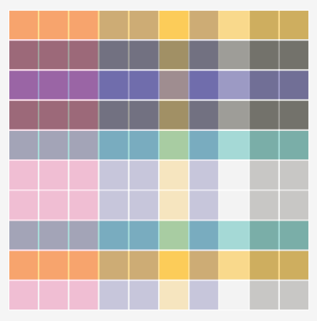

# Arte generativa com SVG e JS

Criação de exemplos de arte generativa com SVG.
O objetivo é usar como experimento e aquecimento para codar. É divertido.

Os exemplos sendo criados a partir dos seguintes tutoriais:

* https://georgefrancis.dev/writing/a-generative-svg-starter-kit/
* https://frontend.horse/articles/generative-grids/

Estou adaptando um pouco os tutoriais para um código mais direto e para rodar direto no navegador. Para rodar, é preciso rodar `npm install` e depois só abrir o arquivo de exemplo.

## Exemplos

### 1 - Camisa Xadrez 

[O primeiro exemplo](./examples/1-plaid.html) é um padrão simples com barras horizontais e verticais transparentes que se entrelaçam.

